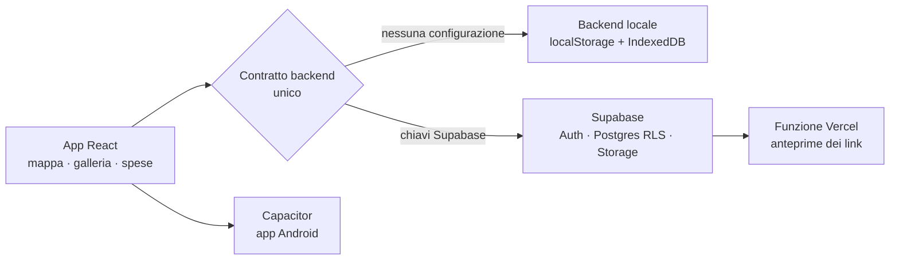

# TravelMind

**Il diario di viaggio che si costruisce da solo mentre viaggi.** Foto, video, note vocali, luoghi e spese finiscono su una mappa, in una galleria e in un calendario, e alla fine diventano un album.

🔗 **Demo:** [travelmind-amber.vercel.app](https://travelmind-amber.vercel.app)

> 🚧 **In sviluppo.** Il cuore dell'app funziona. Mancano la stampa a pagamento e la pubblicazione sugli store.
>
> 🔒 Il codice sorgente è in un repository privato. Questa pagina descrive il progetto, le scelte tecniche e lo stato dei lavori: se vuoi vedere il codice, [scrivimi](#contatti) e te lo mostro.

## Cosa fa

- 🗺️ **Mappa dei ricordi**: ogni foto, video o nota finisce sul luogo in cui è stata presa, con i marker raggruppati e una "carta" per ogni provincia visitata.
- 📸 **Cattura veloce**: foto, video e note vocali in un tocco. Posizione e data vengono lette in automatico dai dati EXIF.
- 🖼️ **Galleria, calendario e video** per rivivere il viaggio in ordine di tempo.
- 💶 **Spese di gruppo**: chi ha pagato cosa, bilancio tra i partecipanti, report esportabile.
- 📕 **Album in PDF** generato dal viaggio.
- 🔗 **Condivisione con link**, con anteprima vera per ogni ricordo condiviso.
- 📴 **Funziona senza rete**: spese e ricordi restano al sicuro e si sincronizzano appena torna la connessione.
- 👥 **Viaggi condivisi**: inviti, membri, più viaggi per utente.
- 🛠️ **Pannello di amministrazione**: utenti, progetti, statistiche, registro attività, impostazioni.
- 🌍 **5 lingue**: italiano, inglese, francese, spagnolo, tedesco.
- 🔐 **Privacy prima di tutto**: il GPS chiede il permesso solo dopo aver spiegato perché, e sul database valgono le Row Level Security.

## Stack

| | |
|---|---|
| Frontend | React 18, React Router, Tailwind CSS, i18next |
| Mappe e grafici | Leaflet + MarkerCluster, mappe vettoriali, Chart.js |
| Backend | Supabase (Auth, Postgres con RLS, Storage, upload riprendibili con tus) oppure backend locale (localStorage + IndexedDB) |
| Mobile | Capacitor 8 per Android: fotocamera, GPS in background, file system, condivisione |
| Deploy | Vercel, con una funzione serverless per le anteprime dei link condivisi |
| Qualità | **226 test** (Jest + React Testing Library), script di controllo delle traduzioni |

## Architettura

### Le scelte che contano

- **Due backend intercambiabili con lo stesso contratto.** Senza configurazione l'app parte subito in locale, senza account e senza setup. Con le chiavi Supabase diventa multi-dispositivo, con Row Level Security. Lo stesso codice dell'interfaccia funziona con entrambi.
- **Offline-first.** Una coda locale conserva le modifiche fatte senza rete e le sincronizza al ritorno della connessione. In viaggio la rete manca proprio quando servirebbe.
- **Il negozio non ha un pulsante "Compra", di proposito.** Finché non c'è un fornitore di stampa, la pagina raccoglie solo chi vuole essere avvisato. È un modo per validare la domanda prima di investire.

## Stato del progetto

| Parte | Stato |
|---|---|
| Mappa, cattura, galleria, calendario | ✅ Funzionante |
| Spese di gruppo e bilancio | ✅ Funzionante |
| Album PDF, condivisione con link | ✅ Funzionante |
| Modalità offline | ✅ Funzionante |
| App Android (Capacitor) | 🟡 Progetto pronto, non ancora sugli store |
| Negozio (album e stampe su carta) | 🟡 Catalogo pronto, manca il fornitore di stampa |
| Pubblicazione su Play Store | ⏳ Da fare |

## Contatti

Progetto di **Samuele Previtali** · previsamu@gmail.com · [LinkedIn](https://www.linkedin.com/in/samuele-giovanni-previtali) · [altri progetti](https://github.com/SamuelePrevitali)

---

© 2026 Samuele Previtali. Tutti i diritti riservati.
